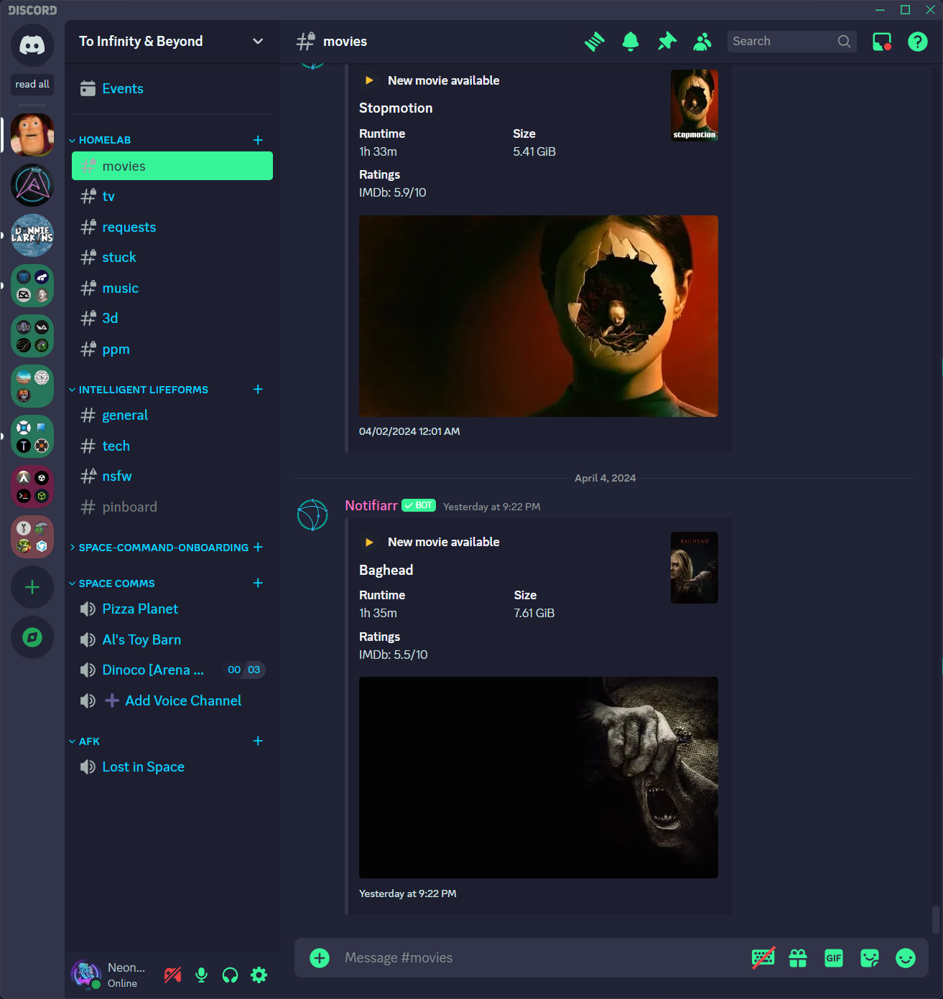

<!-- DO NOT CHANGE THIS -->

Eldritch is a community-driven dark theme inspired by Lovecraftian horror. With tones from the dark abyss and an emphasis on green and blue, it caters to those who appreciate the darker side of life.

Main Theme repo can be found [here](https://github.com/eldritch-theme/eldritch)

### Showcase
<!-- Your screenshot should go here -->
 

## Installation

- ### [BetterDiscord](https://github.com/BetterDiscord/BetterDiscord)

  - download the theme file [here](https://raw.githubusercontent.com/eldritch-theme/betterdiscord/master/eldritch.theme.css)
  - place it in the BetterDiscord themes folder
  - enable Eldritch in the themes tab

- ### [Vencord](https://github.com/Vendicated/Vencord)
  - go to vencord themes tab
  - paste `https://raw.githubusercontent.com/eldritch-theme/discord/refs/heads/master/eldritch.theme.css` into the box
