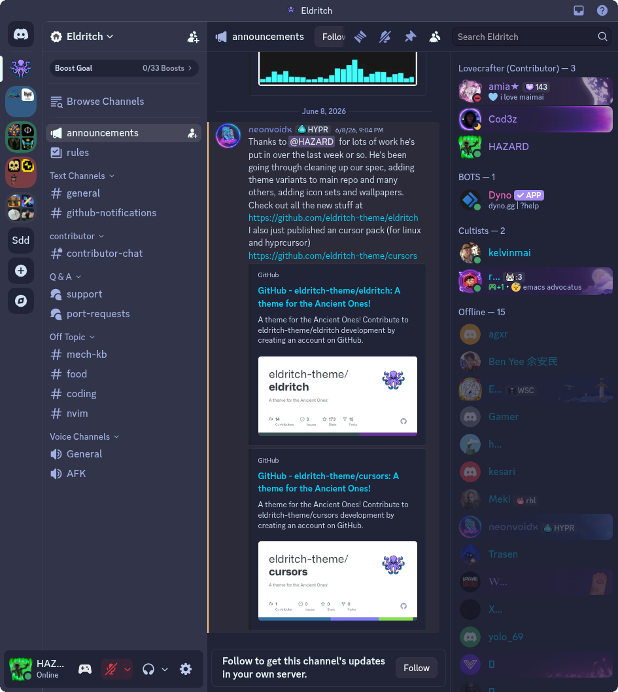
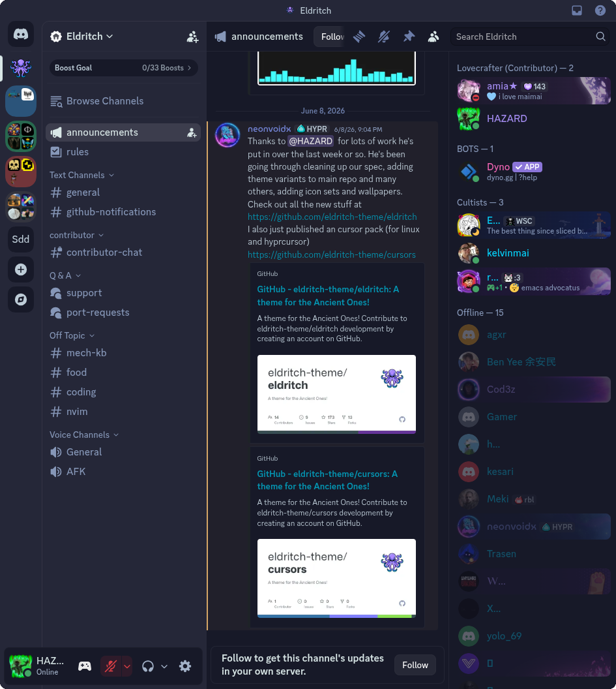
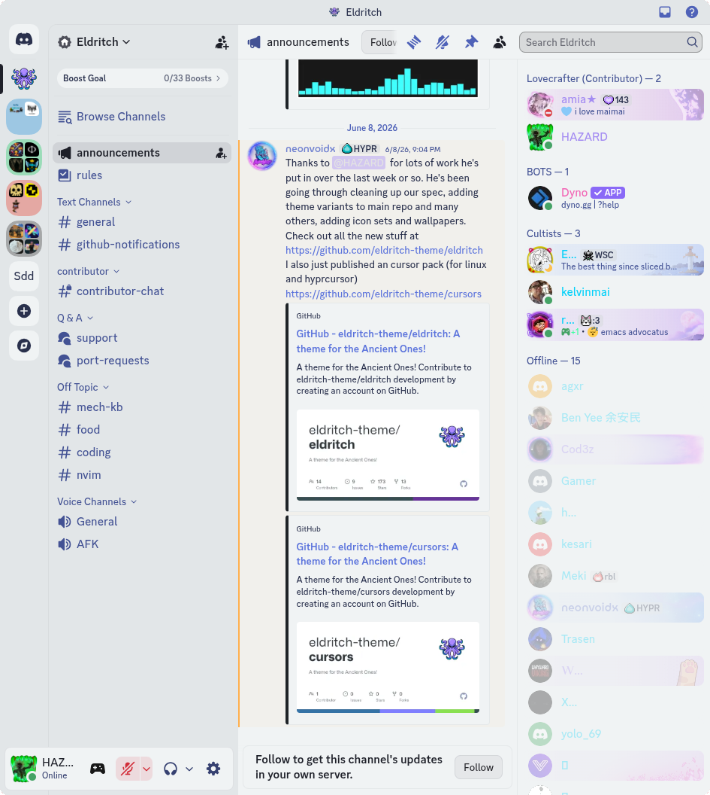

<!-- DO NOT CHANGE THIS -->
<p align="center">
  
</p>
<p>
  Eldritch is a community-driven dark theme inspired by Lovecraftian horror. With tones from the dark abyss and an emphasis on green and blue, it caters to those who appreciate the darker side of life.
</p>

Main Theme repo can be found [here](https://github.com/eldritch-theme/eldritch)

### Showcase

<!-- Your screenshots should go here -->

<details>
    <summary>🦑 Cthulhu (Default)</summary>
    
</details>
<details>
    <summary>🌀 Abyss (Darker)</summary>
    
</details>
<details>
    <summary>🌅 Dusk (Light)</summary>
    
</details>

### Installation

#### [BetterDiscord](https://betterdiscord.app/)

1. Download the theme file of your preferred palette in [themes](themes) into **BetterDiscord**'s themes folder
2. Enable in the Themes tab

#### Clients with custom CSS support

Add your preferred palette into your client's CSS editor:
```css
/* Cthulhu */
@import url("https://raw.githubusercontent.com/eldritch-theme/discord/master/themes/eldritch-cthulhu.theme.css");
/* Abyss */
@import url("https://raw.githubusercontent.com/eldritch-theme/discord/master/themes/eldritch-abyss.theme.css");
/* Dusk */
@import url("https://raw.githubusercontent.com/eldritch-theme/discord/master/themes/eldritch-dusk.theme.css");
```